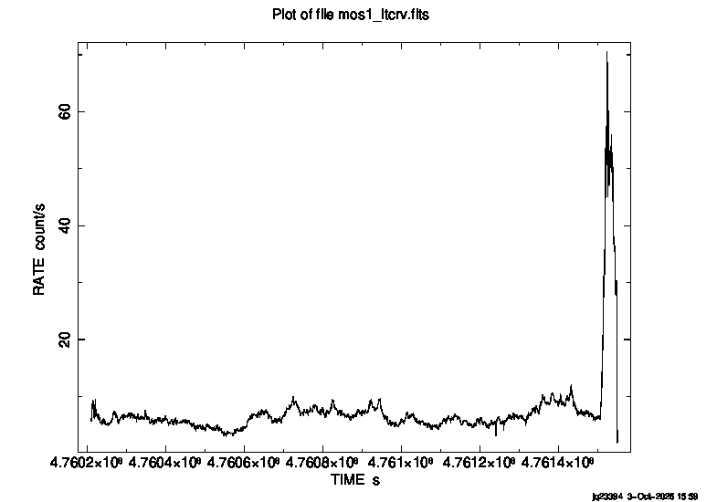

# Week 2

## 2026/09/29

### First Investigations Into Data Reduction

- Can now use solva, and XMM-SAS is installed.
- Have got a script to automate the reduction thanks to Darius Michienzi
    - [GitHub](https://github.com/astro-group-bristol/reduction-scripts)
    - This script is written in Julia so requires a Julia installation on solva
    - Currently running the command `julia` yields the error
        ```
        -bash: julia: command not found
        ```
    - Need to check with Rhys Morris whether Julia is installed, if so how can we access it, and if not whether we can install it
    - For now will proceed with manual reduction to learn the process, as the script may not cover all of our needs, so worth learning how it works under the hood
- Using the XMM-SAS ABC guide
    - Using dataset with OBSID 0761670101
    - Following instructions for EPIC (IMAGING Mode)
    - The first set of commands are
        ```
        cd ODF 
        setenv SAS_ODF /full/path/to/ODF/directory/
        setenv SAS_ODFPATH /full/path/to/ODF/directory/
        cifbuild
        ```
    - This does not currently work, the `setenv` command seems to be for a `csh` shell, while solva uses `bash`
        - This can be worked around by using e.g.
            ```
            export SAS_ODF="/full/path/to/ODF/directory/"
            ```
    - The `cifbuild` command also does not currently work, with the terminal giving the error that the command was not found

### Meeting with Supervisor

- Questions
    - In Fabian et al. (2002) @fabian_long_2002 it says that the red wing of the line extending below 4 keV can be explained by the disc extending within 6 $r_g$ 
        - Why is this?
        - Is this just what their fit says?
    - Maybe start considering how we are going to fit the data? 
        - It may be possible to get a headstart setting up pipelines for it
        - Discuss with Supervisor/Jacob if its worth using Julia (`SpectralFitting.jl`) or `xspec`?
            - Or something else?
        - If using Julia, would it be worth designing our model?
            - Is there anything we can gain from this? More freedom in the parameters etc?

### Meeting Minutes

- When fitting, will use XSPEC
    - Can create a table model if we need to use more abstract metrics etc.
    - Group working on catalogue of metrics have managed to get Gradus working for naked singularities (superspinning black holes)
        - May be able to use this to fit non-standard descriptions to the data, and collaboratively investigate the cosmic censorship conjecture
- Downloading data from XMM-Newton Archive
    - Through legacy interface, create download script (gives `wget` script)
    - May be able to enter RA/DEC to find OBSIDs
- Meeting was successful with Andy's other group
    - They are working on cataloguing spacetimes and investigating the cosmic censorshsolvaip conjecture
        - This is the conjecture that naked singularities do not exist
        - They may be able to compute iron line profiles with this, allowing us to fit this supposedly unphysical model to observations
        - If doing this we will need to construct a table model for XSPEC
    - Groupchat set up with Fionn & Max which should allow us to compare notes and collaborate on issues

### Misc Notes

- Recurring meeting set for 11:00 on Fridays with Jacob to keep each other in the loop and discuss issues

## 2026/09/30

### Intro to Linux Meeting (w/Rhys Morris)

- [star.bris.ac.uk/project_access](https://www.star.bris.ac.uk/project_access/)

## 2026/10/01

### XMM-SAS and Julia Setup

Once logged into solva, XMM-SAS and Julia can be set up by running:

```{.bash  .code-overflow-wrap}
module load julia/1.9.2
```

for Julia, which can be tested by simply running `julia`. XMM-SAS requires a few more lines of setup:

```{.bash  .code-overflow-wrap}
# First initialise HEASOFT

export HEADAS=/opt/local/rocky8/heasoft-6.36/x86_64-pc-linux-gnu-libc2.28/
alias heainit=". $HEADAS/headas-init.sh"
heainit

# Then initialise XMM-SAS
module load anaconda/3-2024
export SAS_DIR=/opt/local/rocky8/xmmsas_20230412_1735
source $SAS_DIR/sas-setup.sh
```

Running `sasversion` should output

```
sasversion:- Executing (routine): sasversion  -w 1 -V 4
sasversion:- sasversion (sasversion-1.3)  [xmmsas_20230412_1735-21.0.0] started:  2026-10-01T10:13:30.000
sasversion:- XMM-Newton SAS release and build information:

SAS release: xmmsas_20230412_1735-21.0.0
Compiled on: Sun Apr 16 21:03:42 CEST 2023
Compiled by: sasbuild@sasbld05.iuser.lan
Platform   : RHEL8.6

SAS-related environment variables that are set:

SAS_DIR = /opt/local/rocky8/xmmsas_20230412_1735
SAS_PATH = /opt/local/rocky8/xmmsas_20230412_1735

sasversion:- sasversion (sasversion-1.3)  [xmmsas_20230412_1735-21.0.0] ended:    2026-10-01T10:13:30.000
```

## 2026/10/02

### XMM-Newton Data Reduction

In order to avoid running all of the above commands upon every login session, the following was completed:

With Julia and anaconda loaded, the `module save` command was run, which saves the loaded module configuration to a file. Then, editing `.bashrc` via `nano .bashrc`, the following lines were added to the file:

```{.bash .code-overflow-wrap}
#========ADDED BY USER========#

# Load Modules
module restore

# Environment variables
export HEADAS=/opt/local/rocky8/heasoft-6.36/x86_64-pc-linux-gnu-libc2.28/
export SAS_DIR=/opt/local/rocky8/xmmsas_20230412_1735

# Init HEASOFT
alias heainit=". $HEADAS/headas-init.sh"
heainit

# Init SAS
alias sasinit="source $SAS_DIR/sas-setup.sh"

#========ADDED BY USER========#
```

This initialises all of the environment variables upon login, and all that is needed to do is to run `sasinit`.

Data was downloaded using a `wget` command as follows:

```{.bash .code-overflow-wrap}
wget -v -q -nH --no-check-certificate --cut-dirs=4 -r -l0 -w1 -c -N -np -R 'index*' -erobots=off https://heasarc.gsfc.nasa.gov/FTP/xmm/data/rev0//0123700101/ODF/
```


It is currently believed that this can be reused 

#### Pipeline Reprocessing

With this working, I began working through the XMM-SAS ABC guide for data reduction. Everything up to the end of the making a Light Curve section of the [ABC guide](https://heasarc.gsfc.nasa.gov/docs/xmm/sl/epic/image/sas_cl.html) is automated by the script provided by Darius Michienzi.

Run the script using 
```{.bash .code-overflow-wrap}
# Unzip any zipped files
gzip -d *.gz

# Run the script
julia /home/jq23394/XMM-data-reduction.jl
```

in the ODF directory. Set useful environment variables using:
```{.bash .code-overflow-wrap}
export SAS_ODFPATH="$(pwd)"
export SAS_CCFPATH="/opt/local/XMM/ccf/"
export SAS_CCF="$SAS_ODFPATH/ccf.cif"
export SAS_ODF="$SAS_ODFPATH/$(ls *SUM.SAS)"
```

evselect table=mos1_filt.fits withrateset=Y rateset=mos1_ltcrv.fits maketimecolumn=Y timebinsize=100 makeratecolumn=yes 

#### Time Filtering

The next step is to apply time filters, which can be done by looking at either the rate or the time intervals. To filter by rate, use the syntax

```{.bash .code-overflow-wrap}
tabgtigen table=mos1_ltcrv.fits gtiset=gtiset.fits expression='RATE<=6' 
```

where the expression `RATE<=6` selects all regions with a rate below 6 ct/s. To filter by time, use the syntax 

```{.bash .code-overflow-wrap}
tabgtigen table=mos1_ltcrv.fits gtiset=gtiset.fits timecolumn=TIME expression='TIME <= 73227600'
```

where the expression `TIME<=73227600` selects the region below a given timestamp. Conditions can be combined using e.g. `(EXP1)&&(EXP2)&&!(EXP3)` which means that regions will be taken from expressions 1 and 2, and ignore anything that matches expresssion 3.

Either of these methods will generate a gti file, which can be used as

```{.bash .code-overflow-wrap}
evselect table=mos1_filt.fits filtertype=expression filteredset=mos1_filt_time.fits expression='GTI(gtiset.fits,TIME)'
```

#### Image and Source Detection

After this, run 

```{.bash .code-overflow-wrap}
atthkgen atthkset=attitude.fits
```

Next, we produce images using binsizes of 22 or 82 for the MOS or PN cameras respectively. This corresponds to the size of the pixels of each on the sky, being 1.1" and 4.1", respectively.

```{.bash .code-overflow-wrap}
evselect table=mos1_filt_time.fits withimageset=yes imageset=mos1-s.fits imagebinning=binSize xcolumn=X ximagebinsize=22 ycolumn=Y yimagebinsize=22 filtertype=expression expression='(FLAG == 0)&&(PI in [300:2000])'

evselect table=mos1_filt_time.fits withimageset=yes imageset=mos1-h.fits imagebinning=binSize xcolumn=X ximagebinsize=22 ycolumn=Y yimagebinsize=22 filtertype=expression expression='(FLAG == 0)&&(PI in [2000:10000])'

evselect table=mos1_filt_time.fits withimageset=yes imageset=mos1-all.fits imagebinning=binSize xcolumn=X ximagebinsize=22 ycolumn=Y yimagebinsize=22 filtertype=expression expression='(FLAG == 0)&&(PI in [300:10000])'
```

replacing the options `mos1_filt_time.fits` and the image bin sizes as necessary.

Initial runs of this resulted in the error 

```{.code-overflow-wrap}
** evselect: error (ExprColGenError), Error: UnknownColumn: No column named `X' in table `/tmp/fileYpufn0:EVENTS'
Column `X' does not exist in table `/tmp/fileYpufn0:EVENTS'
```

Using `ftlist` on the filtered events file showed that the columns `X` and `Y` did not exist. Due to this the data used in the ABC guide was downloaded to test that the instructions work in the first place. It was noticed that during the reprocessing steps `emproc` and `epproc`, the messages 

```
Column X does not exist - creating
Column X does not exist - creating
```

would frequently appear. The issue may thus be an error during this step. Following through the instructions for the example dataset yielded successful results, thus more investigation is required.

## 2026/10/03

With the confirmation that the instructions work for the example dataset (OBSID=0123700101), I returned to a MCG-6-30-15 dataset (OBSID=0693781301) and manually ran each command rather than using the script. I also attempted the process with the observation 0111570101, however this data seemed much less promising. The process was as follows:

```{.bash .code-overflow-wrap}
# Enter the ODF directory
cd ODF

# Unzip
gzip -d *.gz

# Set environment variables and build cif file
export SAS_ODFPATH="$(pwd)"
export SAS_ODF="$(pwd)"
export SAS_CCFPATH="/opt/local/XMM/ccf/"
cifbuild

export SAS_CCF="$SAS_ODFPATH/ccf.cif"
odfingest
export SAS_ODF="$SAS_ODFPATH/$(ls *SUM.SAS)"

# Make and enter processing directory
mkdir ../PROC
cd ../PROC

# Reprocessing pipelines
emproc
epproc

# Make a symbolic link
ln -s *_EMOS1_*ImagingEvts.ds mos1.fits

# Apply standard filters
evselect table=mos1.fits filtertype=expression filteredset=mos1_filt.fits expression='(PATTERN <= 12) && (PI in [200:12000]) && #XMMEA_EM'  

# Make a light curve
evselect table=mos1_filt.fits withrateset=Y rateset=mos1_ltcrv.fits maketimecolumn=Y timebinsize=100 makeratecolumn=yes 

# Plot the light curve
fplot mos1_ltcrv.fits TIME RATE - /PS EXIT
```

The lightcurve is shown below



There was a big flare at the end of the observation, which were filtered out with the condition that RATE must be $\leq 15$. 

```{.bash .code-overflow-wrap}
# Creating the GTI (Good Time Interval) file for time filtering
tabgtigen table=mos1_ltcrv.fits gtiset=gtiset.fits expression='RATE<=15' 

# Filtering the events file using the GTI
evselect table=mos1_filt.fits filtertype=expression filteredset=mos1_filt_time.fits expression='GTI(gtiset.fits,TIME)' 

# Creating an attitude file
atthkgen atthkset=attitude.fits

evselect table=mos1_filt_time.fits withimageset=yes imageset=mos1-s.fits imagebinning=binSize xcolumn=X ximagebinsize=22 ycolumn=Y yimagebinsize=22 filtertype=expression expression='(FLAG == 0)&&(PI in [300:2000])'

evselect table=mos1_filt_time.fits withimageset=yes imageset=mos1-h.fits imagebinning=binSize xcolumn=X ximagebinsize=22 ycolumn=Y yimagebinsize=22 filtertype=expression expression='(FLAG == 0)&&(PI in [2000:10000])'

evselect table=mos1_filt_time.fits withimageset=yes imageset=mos1-all.fits imagebinning=binSize xcolumn=X ximagebinsize=22 ycolumn=Y yimagebinsize=22 filtertype=expression expression='(FLAG == 0)&&(PI in [300:10000])'

edetect_chain imagesets='mos1-s.fits mos1-h.fits' eventsets='mos1_filt_time.fits' attitudeset=attitude.fits pimin='300 2000' pimax='2000 10000' ecf='0.878 0.220'
```

The process is currently getting stuck on the `edetect_chain` step.