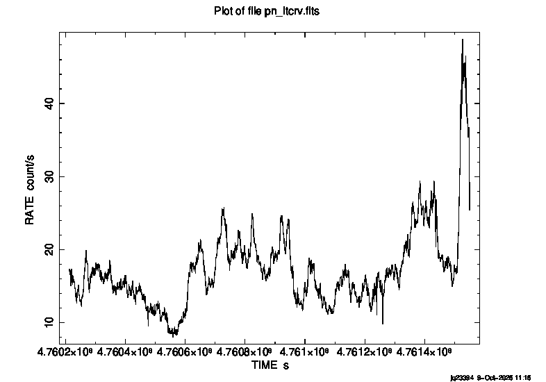
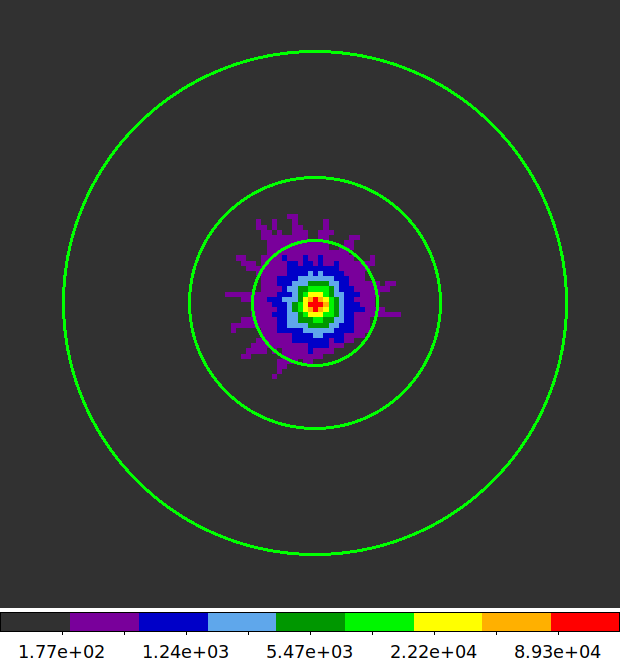
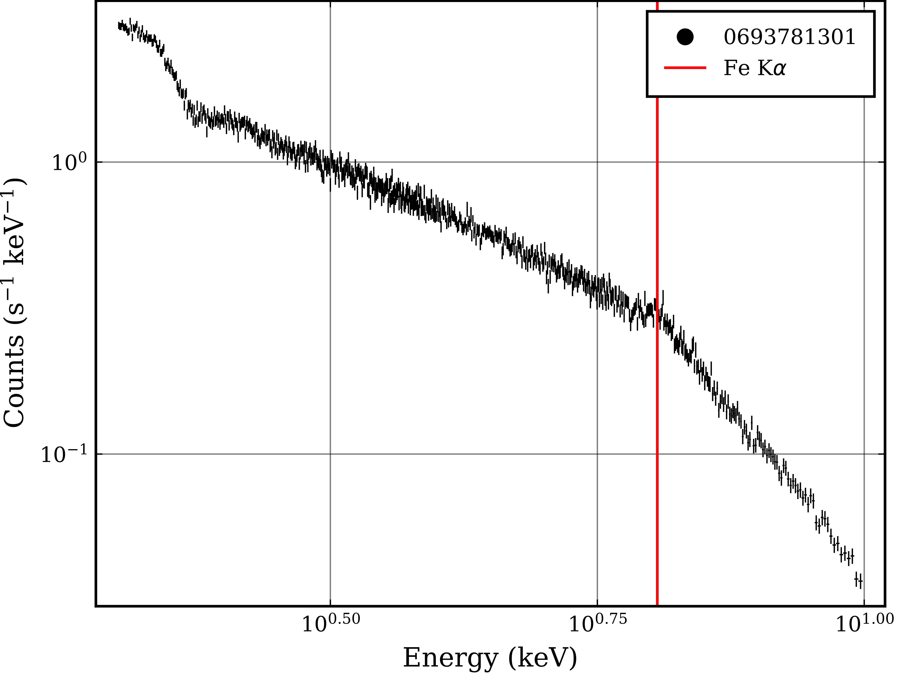

# Week 3

## 2026/10/05

Given that the Julia script was written by somebody else, it was difficult to debug. It was therefore decided that it would be more efficient to rewrite the script in `bash` The script goes to the point of plotting the lightcurves for all three instruments.

The script was added to the shared GitHub repository to download onto solva for testing. A useful command to remember to download a single file from GitHub is:

```{.bash .code-overflow-wrap}
wget --no-check-certificate --content-disposition https://raw.githubusercontent.com/phajy/project-iron-lines/main/code/XMM-Pipeline.sh
```

### Comparing the bash script to Julia

The script was tested successfully and the outputs compared to the Julia script. This was tested by looking at the event file produced from the mos1 instrument using `ftlist`. 

#### Output from the bash script

```
        Name               Type       Dimensions
        ----               ----       ----------
HDU 1   Primary Array      Null Array                               
HDU 2   EVENTS             BinTable    12 cols x 70972 rows         

  Col  Name             Format[Units](Range)      Comment
    1 TIME               D [s]                time of the center of the frame
    2 RAWX               I [PIXELS] (-4:605)  X in node coordinates
    3 RAWY               I [PIXELS] (1:602)   Y in node coordinates
    4 DETX               I [pixel] (-19830:19899) X in linearised camera coordinat
    5 DETY               I [pixel] (-20296:19829) Y in linearised camera coordinat
    6 X                  J [pixel] (1.00000000000000E+00:5.18400000000000E+04) X in projected sky coordinates
    7 Y                  J [pixel] (1.00000000000000E+00:5.18400000000000E+04) Y in projected sky coordinates
    8 PHA                I [CHAN] (0:32767)   total charge of the event (uncor
    9 PI                 I [CHAN] (0:15000)   measured energy in eV (gain corr
   10 FLAG               J                    quality flag
   11 PATTERN            B (0:31)             pattern or grade defining the ev
   12 CCDNR              B (1:17)             1st digit=node (0/1), 2nd digit=CCD (1/7)
```

#### Output from the Julia Script

```
        Name               Type       Dimensions
        ----               ----       ----------
HDU 1   Primary Array      Null Array                               
HDU 2   EVENTS             BinTable     7 cols x 164117 rows        

  Col  Name             Format[Units](Range)      Comment
    1 TIME               D [s]                time of the center of the frame
    2 RAWX               I [PIXELS] (-4:605)  X in node coordinates
    3 PHA                I [CHAN] (0:4095)    total charge of the event (uncor
    4 PI                 I [CHAN] (0:15000)   measured energy in eV (gain corr
    5 FLAG               J                    quality flag
    6 PATTERN            B (0:31)             pattern or grade defining the ev
    7 CCDNR              B (1:17)             1st digit=node (0/1), 2nd digit=CCD (1/7)
```

#### Conclusions

It is clear that the Julia script does not compute a step, or does not do so correctly and thus in further analysis the bash script will be used.

## 2026/10/07

### Meeting with Supervisor

- Suggestions for improving spectrum
	- Plot with more counts per bin
    	- Can rebin with `grppha`
  	- Plot with a log-log scales
  	- Fit with power law and plot ratio of model to data
    	- Fabian figure 1
- PN data may have better energy resolution
- Look at more papers on MCG-6-30-15
	- See what authors have done recently
	- Consider the calibration to see if we need to adjust
- Pileup is not important for PN
  	- Small-window mode, 70% live time
- MOS may have nicer signal to noise
- CTI - charge transfer inefficiency
  	- Some charge gets left behind causing readout streaks
- PSF - shape that a point source takes on the detector
  	- XMM relatively blurry
  	- Pileup depends on multiple photons hitting the same pixel in a given frame
  	- Can exclude the centre of the psf to check for pileup and see if that improves

## 2026/10/07

### Reprocessing the 0693781301 Dataset Using the PN Instrument

Given the recommendation to use data from the PN instrument, the data was reprocessed. First the bash script was ran with the command

```{.bash}
/data/cluster4/BradleyAndJacob/Scripts/XMM-Pipeline.sh
```

The resulting lightcurve is shown below



There is once again a flare towards the end so the GTI was set such that RATE is always less than 30

```{.bash}
# Setting Environment Variables
export SAS_ODFPATH="$(pwd)"
export SAS_CCFPATH="/opt/local/XMM/ccf/"
export SAS_CCF="$SAS_ODFPATH/ccf.cif"
export SAS_ODF="$SAS_ODFPATH/$(ls *SUM.SAS)"

# Creating the GTI (Good Time Interval) file for time filtering
tabgtigen table=pn_ltcrv.fits gtiset=gtiset.fits expression='RATE<=30' 

# Filtering the events file using the GTI
evselect table=pn_filt.fits filtertype=expression filteredset=pn_filt_time.fits expression='GTI(gtiset.fits,TIME)' 

# Creating an attitude file
atthkgen atthkset=attitude.fits

# Creating an image for soft X-ray detections
evselect table=pn_filt_time.fits withimageset=yes imageset=pn-s.fits imagebinning=binSize xcolumn=X ximagebinsize=82 ycolumn=Y yimagebinsize=82 filtertype=expression expression='(FLAG == 0)&&(PI in [300:2000])'

# Creating an image for hard X-ray detections
evselect table=pn_filt_time.fits withimageset=yes imageset=pn-h.fits imagebinning=binSize xcolumn=X ximagebinsize=82 ycolumn=Y yimagebinsize=82 filtertype=expression expression='(FLAG == 0)&&(PI in [2000:10000])'

# Creating an image for all X-ray detections
evselect table=pn_filt_time.fits withimageset=yes imageset=pn-all.fits imagebinning=binSize xcolumn=X ximagebinsize=82 ycolumn=Y yimagebinsize=82 filtertype=expression expression='(FLAG == 0)&&(PI in [300:10000])'
```

The regions selected for source and background extraction were centred on (25628, 23912). The source region was a circle with radius 1000 pixels, and the background was an annulus with inner/outer radii 2000/4000 pixels, respectively.



```{.bash}
eexpmap imageset=pn-h.fits attitudeset=attitude.fits eventset=pn_filt_time.fits expimageset=pn_expmap_2-10keV.fits pimin=2000 pimax=10000

# Extract the Source Spectrum
evselect table='pn_filt_time.fits' energycolumn='PI' filteredset='pn_filtered.fits' filtertype='expression' expression='((X,Y) in CIRCLE(25628,23912,1000))' spectrumset='pn_pi.fits' spectralbinsize=5 withspecranges=yes specchannelmin=0 specchannelmax=20479

# Extract the Background Spectrum
evselect table=pn_filt_time.fits energycolumn='PI' filteredset='bkg_filtered.fits' filtertype='expression' spectrumset='bkg_pi.fits' spectralbinsize=5 expression='((X,Y) in CIRCLE(25628,23912,4000))&&!((X,Y) in CIRCLE(25628,23912,2000))' withspecranges=yes specchannelmin=0 specchannelmax=20479

# Check for Pileup
epatplot set=pn_filtered.fits plotfile=pn_epat.ps useplotfile=yes withbackgroundset=yes backgroundset=bkg_filtered.fits

# Find the source and background region areas for the ancillary file
backscale spectrumset=pn_pi.fits badpixlocation=pn_filt_time.fits
backscale spectrumset=bkg_pi.fits badpixlocation=pn_filt_time.fits

# Generate the Photon Redistribution Matrix
rmfgen rmfset=pn_rmf.fits spectrumset=pn_pi.fits 

# Generate the Ancillary File
arfgen arfset=pn_arf.fits spectrumset=pn_pi.fits withrmfset=yes rmfset=pn_rmf.fits withbadpixcorr=yes badpixlocation=pn_filt_time.fits 
```

The files were then moved to a products folder with

```{.bash}
# Making a folder for the products
mkdir ../PRODUCTS

# Storing the observation ID as a variable
export OBSID="0693781301"

# Moving and renaming the product files
cp pn_pi.fits ../PRODUCTS/$(echo $OBSID)_pn_pi.fits
cp bkg_pi.fits ../PRODUCTS/$(echo $OBSID)_pn_bkg_pi.fits
cp pn_rmf.fits ../PRODUCTS/$(echo $OBSID)_pn_rmf.fits
cp pn_arf.fits ../PRODUCTS/$(echo $OBSID)_pn_arf.fits
```

The products could then be plotted, which was once again done with Julia. Per our supervisor's suggestion, the data was rebinned which was completed using the tool `ftgrouppha` as follows:

```{.bash}
ftgrouppha 0693781301_pn_pi.fits 0693781301_pn_pi_rebin.fits grouptype=min groupscale=400
ftgrouppha 0693781301_pn_bkg_pi.fits 0693781301_pn_bkg_pi_rebin.fits grouptype=min groupscale=400
```

The resulting spectrum is plotted below



The next steps are to fit a power law continuum and observe the ratio between the data and the model. This will be done through the XSPEC software, it will be necessary to mask the region around the iron line such that it doesn't interfere with the fit. Similarly, the soft X-ray region below ~2.5 keV will need to be masked.

The response and background files can be linked to the spectrum file, and the rebinning completed using the `ftools` utility `grppha` as follows:

```{.bash}
grppha 
mos1_pi.fits                    # input spectrum filename
mos1_grp30.fits                 # output spectrum filename
chkey BACKFILE bkg_pi.fits      # include background spectrum
chkey RESPFILE mos1_rmf.fits    # include the RMF
chkey ANCRFILE mos1_arf.fits    # include the ARF
group min 300                   # group the data by 300 counts/bin
exit
```